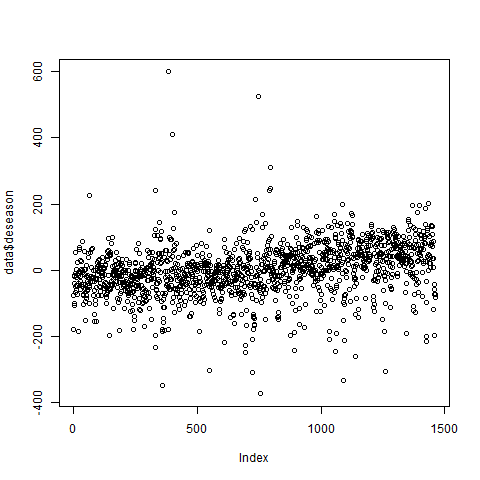

```{r setup, include=FALSE}
knitr::opts_chunk$set(echo = TRUE)
```

```{r message = FALSE}
library("forecast")
library("tseries")
```

Part 1: The Data
-------

The dataset is once again the motor vehicle collisions in NYC. The original dataset is from https://data.cityofnewyork.us/Public-Safety/NYPD-Motor-Vehicle-Collisions/h9gi-nx95; it was downloaded on April 1st, 2017 and transformed in my last project so that the only data left is the number of motor vehicle collisions each day in NYC, beginning from January 1st, 2013 and ending on December 31st, 2016. The data was deseasonalized by month and by day of week by having weekly and monthly averages subtracted. Let's read it in.

```{r eval = FALSE}
data <- read.csv("deseasonalizedCPD.csv")
head(data)

  X year month       date count    demonth wkday   deseason
1 1 2013     1 2013-01-01   381 -155.59677  Tues -180.26703
2 2 2013     1 2013-01-02   480  -56.59677   Wed  -75.74630
3 3 2013     1 2013-01-03   549   12.40323 Thurs  -14.37871
4 4 2013     1 2013-01-04   505  -31.59677   Fri -101.02860
5 5 2013     1 2013-01-05   389 -147.59677   Sat -106.69062
6 6 2013     1 2013-01-06   393 -143.59677   Sun  -40.61984
```

Here is a time series plot of the data (already deseasonalized), along with the ACFs and PACFs.

```{r eval = FALSE}
plot(data$deseason)
```

```{r eval = FALSE}
Acf(data$deseason)
```


```{r eval = FALSE}
Pacf(data$deseason)
```


```{r eval = FALSE}
deseason <- data$deseason[-length(data$deseason)]
```

The data looks stationary, but with a very slight upwards trend, although the ACF and PACF plots do not really say anything either way. We will take a look at the differences.

```{r eval = FALSE}
diff.deseasonalized.cpd <- c(NA, diff(deseason))
plot(diff.deseasonalized.cpd)
```


```{r eval = FALSE}
Acf(diff.deseasonalized.cpd)
```

```{r eval = FALSE}
Pacf(diff.deseasonalized.cpd)
```


First-order autocorrelations are negative for both the ACF and PACF plots at nearly -0.4,
which could possibly be a sign of overdifferencing. Thus, for the ARIMA, we will use the undifferenced data and include a constant. The ACF and PACF plots both suggest large MA(q) and AR(p) models, but it is likely that a mixed ARMA(p,q) model can do better. We will let AICc decide for p and q up to 4.

Part 2: ARIMA Modeling
-------

```{r eval = FALSE}
p <- rep(0:4, times = 5)
d <- rep(1, times = 25)
q <- rep(0:4, each = 5)
pdq <- matrix(c(p,d,q), nrow = 3, byrow = TRUE)
#builds a matrix where each column is a different pdq combination for each combination of p and q from 0 to 4.
aicc <- unlist(lapply(1:25, function(x){Arima(deseason,
pdq[,x], include.constant=TRUE, method = "ML")$aicc}))
#iterates through every possibe combination of p and q from 0 to 4 using the columns of the pdq matrix
```

Here is a table of AICc scores:

```{r eval = FALSE}
min(aicc)
aicc.scores <- matrix(c(p, d, q, aicc), ncol = 4, dimnames = list(c(1:25),
c("p", "d", "q", "AICC")))
aicc.scores
```

```{r eval = FALSE}
   p d q     AICC
1  0 1 0 17244.13
2  1 1 0 17003.31
3  2 1 0 16906.25
4  3 1 0 16830.36
5  4 1 0 16773.34
6  0 1 1 16731.66
7  1 1 1 16618.68
8  2 1 1 16616.10
9  3 1 1 16617.48
10 4 1 1 16615.63
11 0 1 2 16637.43
12 1 1 2 16614.90
13 2 1 2 16613.71
14 3 1 2 16620.02
15 4 1 2 16620.84
16 0 1 3 16620.52
17 1 1 3 16613.86
18 2 1 3 16618.47
19 3 1 3 16622.88
20 4 1 3 16619.07
21 0 1 4 16620.76
22 1 1 4 16623.21
23 2 1 4 16617.86
24 3 1 4 16619.02
25 4 1 4 16619.86
```

The minimum AICc yielded the Arima(2,1,2) model.

```{r eval = FALSE}
model1 <- Arima(deseason, order = c(2,1,2),
include.constant = TRUE, method = "ML")
summary(model1)
```

```{r eval = FALSE}
Series: deseason 
ARIMA(2,1,2) with drift         

Coefficients:
         ar1      ar2      ma1     ma2   drift
      0.8906  -0.1169  -1.6211  0.6211  0.0577
s.e.  0.1018   0.0442   0.0981  0.0980  0.0074

sigma^2 estimated as 5115:  log likelihood=-8300.83
AIC=16613.65   AICc=16613.71   BIC=16645.36

Training set error measures:
                     ME     RMSE      MAE      MPE     MAPE      MASE        ACF1
Training set -0.7417418 71.37465 49.20882 -5.80813 294.8843 0.8099552 0.002364426
```

The Arima model is given by: Xt = .8906Xt-1 - .1169Xt-2 -1.6211Et-1 + 0.6211Et-2 + Et with a drift of 0.0577.

Every estimated coefficient in the model is statistically significant with the coefficient
estimates being over 2 standard deviations away from 0. 

Here are the fitted values, with the last 10 fitted values printed out:

```{r eval = FALSE}
f <- fitted.values(model1)
tail(f, 10)
```

```{r eval = FALSE}
Time Series:
Start = 1451 
End = 1460 
Frequency = 1 
 [1]  67.09265387  57.49520601  60.72203555  46.76719173  36.64622393  -0.40652299 -29.79576245   2.29376129
 [9]  -0.08805592  -3.05173904
```

To get a better view of the model's adequacy and to see if a GARCH model is warranted,, we should look at the residuals. 

Part 3: ARIMA Residuals
-------

```{r eval = FALSE}
resid <- model1$residuals
```

```{r eval = FALSE}
plot(resid)
```


```{r eval = FALSE}
Acf(resid)
```


```{r eval = FALSE}
Pacf(resid)
```


The time series plot seems to exhibit some level-dependent volatility, with certain areas
much wider than others. The ACF and PACF plots show that the residuals seem to have
statistically significant autocorrelation at lags 5, 10, 14, and 18.

We can verify this using the Ljung-Box statistics. The directions in the homework states to
use lags 12, 24, 26, and 48, but that is with the assumption of monthly data; for daily data,
lags 7, 14, 21, and 28 will be used. The degrees of freedom is 5, since the model estimates 5
coefficients including the constant.

```{r eval = FALSE}
lapply(seq(7, 28, length.out = 4), function(x){Box.test(residuals(model1),
lag = x, type = "Ljung-Box", fitdf = 5)})
```

```{r eval = FALSE}
[[1]]

	Box-Ljung test

data:  residuals(model1)
X-squared = 6.1117, df = 2, p-value = 0.04708


[[2]]

	Box-Ljung test

data:  residuals(model1)
X-squared = 27.185, df = 9, p-value = 0.001304


[[3]]

	Box-Ljung test

data:  residuals(model1)
X-squared = 35.347, df = 16, p-value = 0.003562


[[4]]

	Box-Ljung test

data:  residuals(model1)
X-squared = 45.202, df = 23, p-value = 0.003754
```

The Ljung-Box test rejects the null hypothesis, which is that there is no autocorrelation within the residuals, for all lags tested. This means that there is very likely to be autocorrelation remaining within the residuals that the ARIMA model was unable to take care of.

Here are an ACF and PACF of the squared residuals.

```{r eval = FALSE}
resid.sq <- resid^2
```

```{r eval = FALSE}
plot(resid.sq, type = "l")
```


```{r eval = FALSE}
Acf(resid.sq)
```


```{r eval = FALSE}
Pacf(resid.sq)
```


The ACF and PACF plots have an above average amount of statistically significant autocorrelation in the later lags. These autocorrelations, however, do not account for the extremely obvious correlations in the volatility of the dataset. Thus, a GARCH model for the volatility is warranted.

Part 4: ARCH modeling
-------

Here are the AICc values for the ARCH(q):

```{r eval = FALSE}
q2 <- 1:10
N <- length(resid)
loglik <- unlist(
 lapply(1:length(q2), function(x){
 fit1 <- garch(resid, c(0,x), trace = FALSE)
 logLik(fit1)
 }))
loglik <- c(-0.5 * N * (1 + log(2 * pi * mean(resid.sq))), loglik)
q2 <- c(0, q2)
k <- q2 + 1
aicc.garch <- -2 * loglik + 2 * k * N / (N - k - 1)
cbind(q2, loglik, aicc.garch)
```

```{r eval = FALSE}
      q2    loglik aicc.garch
 [1,]  0 -8302.847   16607.70
 [2,]  1 -8239.164   16482.34
 [3,]  2 -8245.464   16496.94
 [4,]  3 -8237.315   16482.66
 [5,]  4 -8229.347   16468.74
 [6,]  5 -8222.474   16457.01
 [7,]  6 -8222.036   16458.15
 [8,]  7 -8215.610   16447.32
 [9,]  8 -8207.437   16433.00
[10,]  9 -8192.928   16406.01
[11,] 10 -8186.302   16394.79
```

Here is the AICc for the GARCH(1,1).

```{r eval = FALSE}
garch.11 <- garch(resid, c(1,1), trace = FALSE)
loglik.garch.11 <- logLik(garch.11)
k2 <- 2
aicc.garch.11 <- -2 * loglik.garch.11 + 2 * k2 * N / (N - k2 -1)
loglik.garch.11
```

```{r eval = FALSE}
'log Lik.' -8251.541 (df=3)

aicc.garch.11

'log Lik.' 16507.09 (df=3)
```

The best model selected by AICc is the ARCH(10) model. Here is a summary of its output:

```{r eval = FALSE}
garch.0.10 <- garch(resid, c(0,10), trace = FALSE)
summary(garch.0.10)
```

```{r eval = FALSE}
Call:
garch(x = resid, order = c(0, 10), trace = FALSE)

Model:
GARCH(0,10)

Residuals:
     Min       1Q   Median       3Q      Max 
-4.70895 -0.51758  0.01377  0.55246  7.90679 

Coefficient(s):
     Estimate  Std. Error  t value Pr(>|t|)    
a0  2.549e+03   1.910e+02   13.340  < 2e-16 ***
a1  1.822e-01   1.148e-02   15.868  < 2e-16 ***
a2  4.723e-02   1.687e-02    2.799  0.00512 ** 
a3  2.461e-02   1.784e-02    1.379  0.16776    
a4  3.524e-02   1.490e-02    2.366  0.01800 *  
a5  2.993e-02   1.827e-02    1.638  0.10136    
a6  1.719e-11   1.153e-02    0.000  1.00000    
a7  2.831e-02   1.791e-02    1.581  0.11393    
a8  3.380e-02   1.951e-02    1.732  0.08322 .  
a9  6.430e-02   1.106e-02    5.811 6.19e-09 ***
a10 5.079e-02   2.237e-02    2.270  0.02319 *  
---
Signif. codes:  0 '***' 0.001 '**' 0.01 '*' 0.05 '.' 0.1 ' ' 1

Diagnostic Tests:
	Jarque Bera Test

data:  Residuals
X-squared = 3788.2, df = 2, p-value < 2.2e-16


	Box-Ljung test

data:  Squared.Residuals
X-squared = 0.67104, df = 1, p-value = 0.4127
```

```{r eval = FALSE}
logLik(garch.0.10)
```

```{r eval = FALSE}
'log Lik.' -8186.302 (df=11)
```

The Jarque-Bera test, which has null hypothesis that the residuals have 0 skew and kurtosis, has been thoroughly rejected. This suggests that the residuals may have problems with normality.

The Box-Ljung test, which has null hypothesis that the residuals are uncorrelated, is unable to reject the null hypothesis at a 0.05 level. The residuals given by the ARCH model do not seem correlated, which is good.

Not all of the parameters are statistically significant; the a6 parameter, in particular, has a p-value of 1, all but guaranteeing that it is not statistically significant. As a result, its coefficient is very close to zero. Non-statistically significant parameters are a problem when the model is the correct model to use. Here is the formula for the ARCH(10):

h(t) = a0 + a1E^2(t-1) + a2E^2(t-2) + ... + a10E^2(t-10)

h(t) = 2.529e+03 + 1.806e-01 + 4.571e-02 + 2.348e-02 + 3.861e-02 + 2.504e-02 + 2.121e-11 + 3.263e-02 + 3.433e-02 + 6.828e-02 + 5.234e-02

where h(t) is the expected conditional variance at time t given the information set of all shocks before it.

Part 5: 95% one step ahead forecast interval
-------

```{r eval = FALSE}
f1 <- forecast(model1, 1)

ht <- garch.0.10$fitted.values[,1]^2
rev.resid.sq <- rev(resid.sq)
h1 <- 2.529 * 10^3 + 1.806 * 10^-1 * rev.resid.sq[1] + 4.571 * 10^-2 * rev.resid.sq[2] + 2.348 * 10^-2 * rev.resid.sq[3] + 3.861 * 10^-2 * rev.resid.sq[4] + 2.504 * 10^-2 * rev.resid.sq[5] + 2.121 * 10^-11 * rev.resid.sq[6] + 3.263 * 10^-2 * rev.resid.sq[7] + 3.433 * 10^-2 * rev.resid.sq[8] + 6.828 * 10^-2 * rev.resid.sq[9] + 5.234 * 10^-2 * rev.resid.sq[10]
h1
```

```{r eval = FALSE}
[1] 4836.489
```

```{r eval = FALSE}
f1$mean[1] + c(-1,1) * 1.96 * sqrt(h1)
```

```{r eval = FALSE}
[1] -139.8799  132.7360
```

```{r eval = FALSE}
f1
```

```{r eval = FALSE}
     Point Forecast     Lo 80   Hi 80     Lo 95    Hi 95
1461       -3.57197 -95.26114 88.1172 -143.7985 136.6545
```

The interval given by the GARCH model (-139.8799, 132.7360) is slightly thinner than the default given by the ARIMA model (-143.7985, 136.6545). This is probably because the most recent data is experiencing a period of relative calm.

```{r eval = FALSE}
data$deseason[length(data$deseason)]
```

```{r eval = FALSE}
[1] -81.63417
```

The last data point of the original dataset, which was left outside of the training dataset, has a value of -81.63417. This is well within the prediction interval given by the ARIMA-ARCH model, so the model does not appear to be too terrible.

Part 6: Volatility Check
-------

Here are the last 10 conditional variances:

```{r eval = FALSE}
tail(ht, 10)
```

```{r eval = FALSE}
Time Series:
Start = 1451 
End = 1460 
Frequency = 1 
 [1]  3474.971  3215.763  3558.934  3661.851  3534.325  7425.974 11046.062  5586.751  5568.813  5868.007
```

Here is a plot of the conditional variances.
```{r eval = FALSE}
plot(ht, type = "l")
```


```{r eval = FALSE}
plot(deseason, type = "l")
```


There are two especially large patches of volatility in the neighborhood of data point 400 and 750. The periods of high conditional variances generated by the GARCH model match up with the periods of high volatility within the data for car crashes.

Part 7: Time Series Plot
-------

Here is a time series plot which shows the daily car crash counts, together with the ARIMA-ARCH one-step-ahead 95% forecast intervals based on information available in the previous day.

```{r eval = FALSE}
plot(deseason, type = "l")
lines(f + 1.96 * sqrt(ht), lty = 2, col = "red")
lines(f - 1.96 * sqrt(ht), lty = 2, col = "red")
```


The forecast intervals are quite accurate, although they seem to be fairly conservative for much of the data. They are definitely better than the default ones given by the ARIMA model.

Part 8: ARCH Residuals
-------

Here is a normal probability plot of the residuals.

```{r eval = FALSE}
resid.arch <- resid / sqrt(ht)
qqnorm(resid.arch)
```


The ARCH residuals seem to have a heavy tails, with especially heavy right tails. Thus, the arch residuals are non-normal, which is also what the results of the Jarque-Bera test implied.

Part 9: Prediction Interval
-------

Here is a count of the number of prediction failures.

```{r eval = FALSE}
sum(abs(resid.arch) - 1.96 > 0, na.rm=TRUE)
```

```{r eval = FALSE}
[1] 70
```

The percentage of prediction interval failures is given by

```{r eval = FALSE}
sum(abs(resid.arch) - 1.96 > 0, na.rm = TRUE) / sum(!is.na(resid.arch))
```

```{r eval = FALSE}
[1] 0.04827586
```

Which is very close to the expected failure rate of 5%. In sum, the ARIMA(2,1,2)-ARCH(10) model computed in this analysis can be used to create a forecast and forecast interval of car crash counts for the next day.